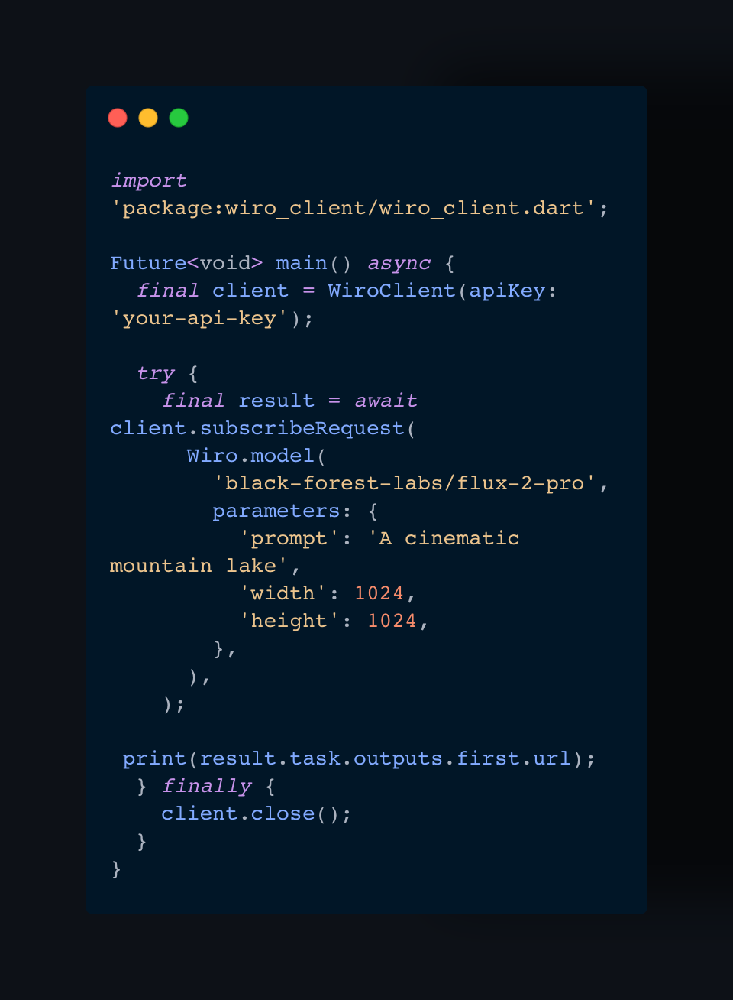
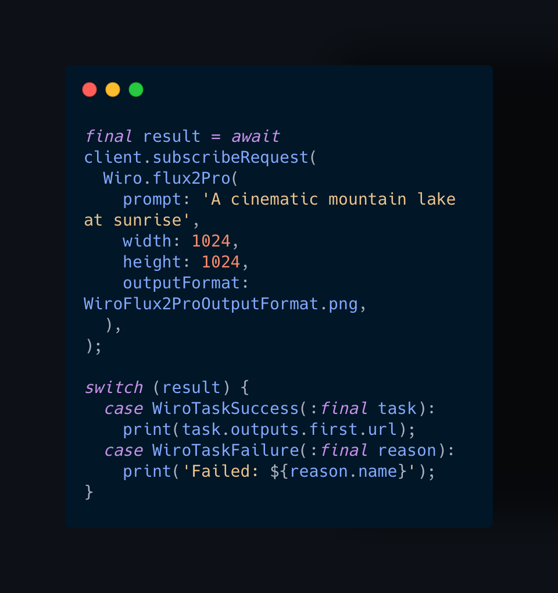
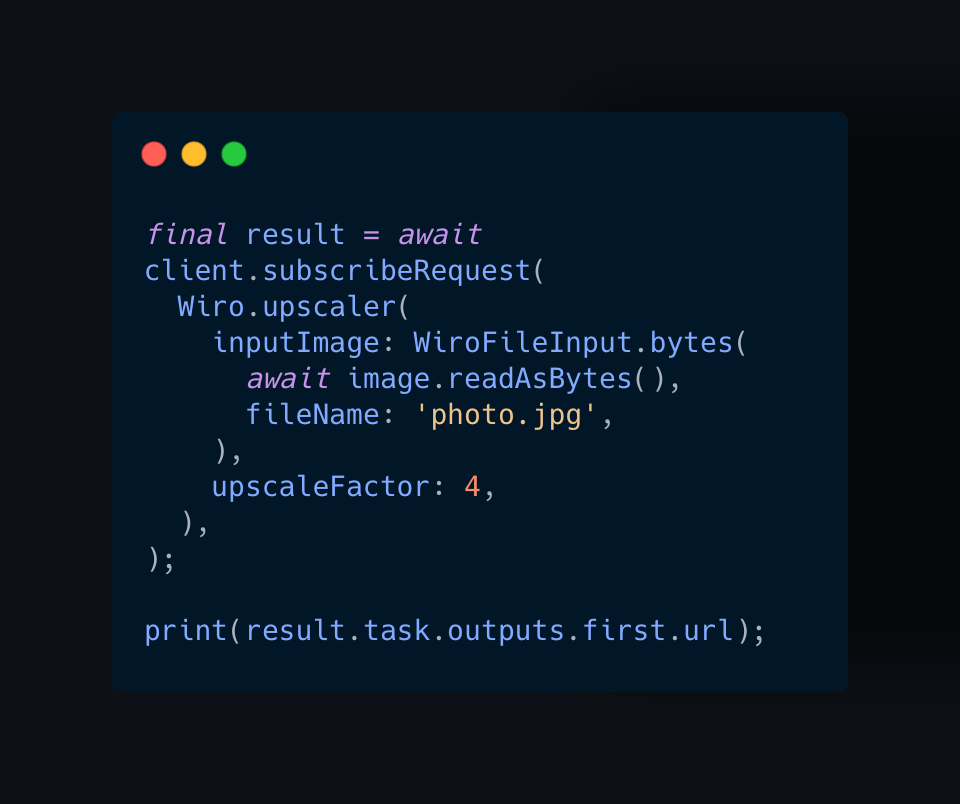
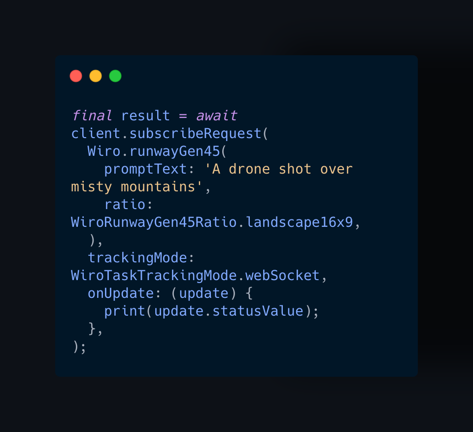

<div align="center">


# Wiro AI SDK for Dart and Flutter

**The official type-safe Dart client for discovering and running AI models on [Wiro](https://wiro.ai)**

[](https://github.com/wiroai/Dart-QuickStart/actions/workflows/ci.yml)
[](https://codecov.io/gh/wiroai/Dart-QuickStart)
[](https://pub.dev/packages/wiro_client)
[](LICENSE)

[Docs](https://wiro.ai/docs) · [Models](https://wiro.ai/models) · [Dashboard](https://wiro.ai/panel) · [Create Project](https://wiro.ai/panel/project/new)

</div>

## Features

- Search and explore available AI models
- Run popular models with compile-time checked typed requests
- Read typed model input schemas
- Validate dynamic parameters against model schemas
- Run image, video, audio, and other generative models
- Use typed model IDs, task tokens, and task IDs
- Submit and await a sealed task result with one `subscribe` call
- Send device files as model inputs with automatic uploads
- Upload byte arrays or streams
- Poll tasks or stream typed progress over WebSocket
- Cancel queued tasks and stop running tasks
- Typed errors for authentication, validation, rate limits, and networking
- Request cancellation, timeouts, retry with exponential backoff, and logging
- API key and signature-based authentication
- Pure Dart core with Flutter, image, and video examples

## Requirements

- Dart `3.8.0` or newer
- Flutter `3.32.8` or newer when used in a Flutter application
- A [Wiro project and API key](https://wiro.ai/panel/project/new)

The core package is pure Dart and supports Dart VM, Android, iOS, web,
macOS, Windows, and Linux. Version `0.x` may receive API refinements before
the first stable release.

## Installation

```bash
dart pub add wiro_client
```

For Flutter applications:

```bash
flutter pub add wiro_client
```

## Quick start

Any model on Wiro runs through `Wiro.model`. Type `Wiro.` in your IDE
to discover typed factories for popular models as well:

<p align="center">
  
</p>

```dart
import 'package:wiro_client/wiro_client.dart';

Future<void> main() async {
  final client = WiroClient(apiKey: 'your-api-key');

  try {
    final result = await client.subscribeRequest(
      Wiro.model(
        'black-forest-labs/flux-2-pro',
        parameters: {
          'prompt': 'A cinematic mountain lake',
          'width': 1024,
          'height': 1024,
        },
      ),
    );
    print(result.task.outputs.first.url);
  } finally {
    client.close();
  }
}
```

## Which call do I need?

| I want to... | Call |
| --- | --- |
| Generate with a supported model | `client.subscribeRequest(Wiro.flux2Pro(...))` |
| Run any other model | `client.subscribeRequest(Wiro.model('owner/model', parameters: {...}))` |
| Find a model | `client.searchModels(search: '...')` or `client.explore()` |
| See what parameters a model takes | `client.getModelSchema(...)`, then `schema.validate(params)` |
| Watch progress | `onUpdate:` callback, or `client.subscribeStream(...)` |
| Send a device file to a model | `WiroFileInput.bytes(bytes, fileName: '...')` — uploaded automatically |
| Cancel or stop a task | `client.cancelTask(...)` / `client.killTask(...)` |
| Keep API keys off the device | `WiroClient.proxied(proxyUri: ...)` |
| Handle failure | `switch` on `WiroTaskSuccess` / `WiroTaskFailure(:reason)` |

## Run a model with a typed request

Popular models ship with typed request classes, so required parameters,
value ranges, and select options are checked at compile time:

<p align="center">
  
</p>

```dart
final result = await client.subscribeRequest(
  Wiro.flux2Pro(
    prompt: 'A cinematic mountain lake at sunrise',
    width: 1024,
    height: 1024,
    outputFormat: WiroFlux2ProOutputFormat.png,
  ),
);

switch (result) {
  case WiroTaskSuccess(:final task):
    print(task.outputs.first.url);
  case WiroTaskFailure(:final reason):
    print('Failed: ${reason.name}');
}
```

Type `Wiro.` in your IDE to list every model with a typed request;
each factory (such as `Wiro.flux2Pro`) returns the matching request
class. Typed requests generated from the live Wiro schemas are included for:

| Category | Models |
| --- | --- |
| Image | FLUX.2 Pro, GPT Image 2, Nano Banana Pro, Seedream v4, Grok Imagine Image |
| Video | Runway Gen-4.5, Seedance 2.0, Kling V3, Veo 3.1, Sora 2 Pro, Hailuo 2.3 Fast, Grok Imagine Video |
| Music | Lyria 3 |

Any other model runs through `Wiro.model` as shown below. `runRequest`
is the non-tracking equivalent of `subscribeRequest`.

Typed requests are generated from the live Wiro model schemas with an
internal tool, so coverage grows with SDK releases. Missing a model?
[Open an issue](https://github.com/wiroai/Dart-QuickStart/issues) to request a
typed binding, or implement `WiroModelRequest` yourself in the meantime.

## Run any model with `Wiro.model`

Models without a typed factory run through `Wiro.model` with a dynamic
parameter map, so every model works even before the SDK ships a binding
for it. Responses are fully typed.

```dart
final result = await client.subscribeRequest(
  Wiro.model(
    'black-forest-labs/flux-2-pro',
    parameters: {
      'prompt': 'A cinematic mountain lake at sunrise',
      'width': 1024,
      'height': 1024,
    },
  ),
  trackingMode: WiroTaskTrackingMode.webSocket,
  onUpdate: (update) {
    switch (update) {
      case WiroTaskEventUpdate(
        event: WiroSocketMessageEvent(
          payload: WiroProgressPayload(:final progress),
        ),
      ):
        print('${update.statusValue}: ${progress.percentage}');
      case WiroTaskSnapshotUpdate() || WiroTaskBinaryUpdate():
        print(update.statusValue);
    }
  },
);

for (final output in result.task.outputs) {
  print(output.url);
}
```

`subscribe` returns `WiroTaskSuccess` or `WiroTaskFailure`, both carrying the
terminal task. `trackingMode` can be `polling` or `webSocket`; polling is the
default. Both modes emit sealed `WiroTaskUpdate` variants. Failures expose a
typed `reason`, and `result.task.elapsed` reports fractional task duration as
a `Duration`.

Use the lower-level API when submission and tracking must be managed separately:

```dart
final run = await client.runModel(
  WiroModelId('openai', 'sora-2'),
  parameters: {'prompt': 'A cinematic mountain lake'},
  callbackUrl: Uri.parse('https://example.com/wiro-webhook'),
);
final taskToken = run.taskToken;
if (taskToken == null) {
  throw StateError('Wiro did not return a task token.');
}
final task = await client.waitForTask(taskToken);
```

Server-derived model IDs, task IDs, task tokens, and socket event IDs are
nullable when Wiro omits or returns invalid identifier fields. Identifiers
created explicitly with `WiroModelId`, `WiroTaskId`, or `WiroTaskToken` remain
strictly validated.

Get the accepted parameters before running a model:

```dart
final schema = await client.getModelSchema(
  WiroModelId('openai', 'sora-2'),
);
for (final parameter in schema.parameters) {
  print('${parameter.id}: ${parameter.runtimeType}');
}
schema.validate({'prompt': 'A cinematic mountain lake'});
```

Select, number, and text parameter variants expose typed `defaultValue`
fields. Unknown variants preserve dynamic defaults, while file parameter
defaults remain available through `parameter.raw['default']`.

## File inputs and uploads

File parameters take `WiroFileInput` values. Wrap an already-hosted file
with `WiroFileInput.url`, or pass raw device bytes (a gallery pick, a
camera shot) with `WiroFileInput.bytes` — the client uploads them
automatically and swaps in the URL before the model runs:

<p align="center">
  
</p>

```dart
final result = await client.subscribeRequest(
  Wiro.model(
    'google/upscaler',
    parameters: {
      'inputImage': [
        WiroFileInput.bytes(
          await image.readAsBytes(),
          fileName: 'photo.jpg',
        ),
      ],
      'upscaleFactor': 4,
    },
  ),
);

print(result.task.outputs.first.url);
```

The same works inside dynamic parameter maps:

```dart
final run = await client.runModel(
  WiroModelId('openai', 'sora-2'),
  parameters: {
    'prompt': 'Animate this image',
    'inputImage': [
      WiroFileInput.url(Uri.parse('https://example.com/input.jpg')),
    ],
    'seconds': '4',
  },
);
```

To manage uploads yourself, call `client.uploadFile(bytes, fileName: ...)`
and pass the returned URL, or use `uploadStream` with an exact
`contentLength` for large files. Streaming avoids SDK-side buffering on
supported runtimes.

## Observe task progress

Pass `onUpdate` or use WebSocket tracking to watch a run live:

<p align="center">
  
</p>

```dart
final result = await client.subscribeRequest(
  Wiro.runwayGen45(
    promptText: 'A drone shot over misty mountains',
    ratio: WiroRunwayGen45Ratio.landscape16x9,
  ),
  trackingMode: WiroTaskTrackingMode.webSocket,
  onUpdate: (update) {
    print(update.statusValue);
  },
);
```

Use `subscribeStream` when an `await for` loop is more convenient than a
callback:

```dart
await for (final update in client.subscribeStream(
  WiroModelId('black-forest-labs', 'flux-2-pro'),
  parameters: {'prompt': 'A cinematic mountain lake'},
)) {
  print(update.statusValue);
}
```

Use WebSocket for realtime lifecycle, progress, LLM, and binary events:

```dart
await for (final event in client.watchTaskSocket(taskToken)) {
  switch (event) {
    case WiroSocketMessageEvent(
      :final statusValue,
      :final payload,
    ):
      switch (payload) {
        case WiroLogPayload(:final message):
          print('$statusValue: $message');
        case WiroProgressPayload(:final progress):
          print('$statusValue: ${progress.percentage}');
        case WiroOutputsPayload(:final outputs):
          for (final output in outputs) {
            print(output.url);
          }
        case WiroUnknownPayload():
          print('$statusValue: unknown payload');
      }
    case WiroSocketBinaryEvent(:final bytes):
      print('Received ${bytes.length} realtime bytes');
  }
}
```

The socket uses Wiro's `task_info` protocol and closes after
`task_postprocess_end` or `task_cancel`. Binary frames are preserved for
realtime audio models.

Polling remains available as a fallback:

```dart
await for (final task in client.watchTask(
  taskToken,
  timeout: const Duration(minutes: 10),
)) {
  print(task.statusValue);
}
```

For a definitive success check, fetch the terminal task and verify
`task.isSuccessful`.

## Cancellation

```dart
final cancellationToken = WiroCancellationToken();

final request = client.searchModels(
  search: 'image',
  cancellationToken: cancellationToken,
);

cancellationToken.cancel();
await request;
```

Cancelled requests throw `WiroRequestCancelledException`.
Cancelling a `subscribeStream` subscription also stops its active polling or
WebSocket tracking without emitting a cancellation error.

## Retries, timeouts, and logging

```dart
final client = WiroClient(
  apiKey: 'your-api-key',
  requestTimeout: const Duration(seconds: 20),
  pollInterval: const Duration(seconds: 2),
  retryPolicy: const WiroRetryPolicy(
    maxRetries: 3,
    initialDelay: Duration(milliseconds: 500),
  ),
  logger: (event) {
    print('${event.level.name}: ${event.message}');
  },
);
```

Automatic retries apply only to safe read-like operations such as model and
task lookup. Model runs and file uploads are not retried because they can
create duplicate billable work. Rate-limit retries respect `Retry-After`.

Logs never contain API keys, secrets, headers, or request bodies.
Malformed nested JSON ignored during response parsing is reported as a debug
log event instead of through global diagnostics state.

## Error handling

```dart
try {
  await client.explore();
} on WiroApiResultException catch (error) {
  // HTTP succeeded, but Wiro rejected the operation.
  print('${error.code}: ${error.message}');
} on WiroAuthenticationException {
  // Invalid or expired credentials.
} on WiroRateLimitException catch (error) {
  print('Retry after: ${error.retryAfter}');
} on WiroSchemaValidationException catch (error) {
  print(error.issues);
} on WiroValidationException catch (error) {
  print(error.message);
} on WiroTimeoutException {
  // Request or task polling timed out.
} on WiroNetworkException {
  // The API could not be reached.
} on WiroUnknownApiException catch (error) {
  print('${error.statusCode}: ${error.message}');
}
```

Wiro can report application-level failures with HTTP 2xx and `result: false`.
The SDK converts these responses to `WiroApiResultException`.

## Authentication

API key authentication:

```dart
final client = WiroClient(apiKey: 'your-api-key');
```

Signature-based authentication:

```dart
final client = WiroClient(
  apiKey: 'your-api-key',
  apiSecret: 'your-api-secret',
);
```

The configured credentials must match the authentication type selected for
the Wiro project.

Never embed long-lived Wiro credentials in a production mobile application.
Use a proxied client so credentials stay on your backend:

```dart
final client = WiroClient.proxied(
  proxyUri: Uri.parse('https://your-backend.example.com/wiro'),
  headers: {'Authorization': 'Bearer $sessionToken'},
);
```

The device sends requests to your proxy without any Wiro headers. The proxy
must accept the same REST paths as the Wiro API, attach `x-api-key` (and
signature headers when required), and forward the request to
`https://api.wiro.ai/v1`. Task WebSocket streams still connect directly to
Wiro because they authenticate with per-task tokens instead of API
credentials.

## Examples

The `example` directory contains:

- A Flutter iOS and Android model explorer
- `bin/generate_image.dart` using Flux 2 Pro
- `bin/generate_video.dart` using Sora 2 with streamed task progress

```bash
cd example

WIRO_API_KEY=your-api-key dart run bin/generate_image.dart
WIRO_API_KEY=your-api-key dart run bin/generate_video.dart

flutter run --dart-define=WIRO_API_KEY=your-api-key
```

The `dart-define` approach is only for local demonstration. Build-time values
can be extracted from a distributed mobile application.

## Documentation

- [Wiro documentation](https://wiro.ai/docs)
- [Available models](https://wiro.ai/models)
- [API reference](https://pub.dev/documentation/wiro_client/latest/)
- [Contributing](CONTRIBUTING.md)
- [Security policy](SECURITY.md)

## License

MIT

---

<div align="center">


**Built with 💚 by the Wiro team**

[wiro.ai](https://wiro.ai) · [GitHub @wiroai](https://github.com/wiroai)

</div>
